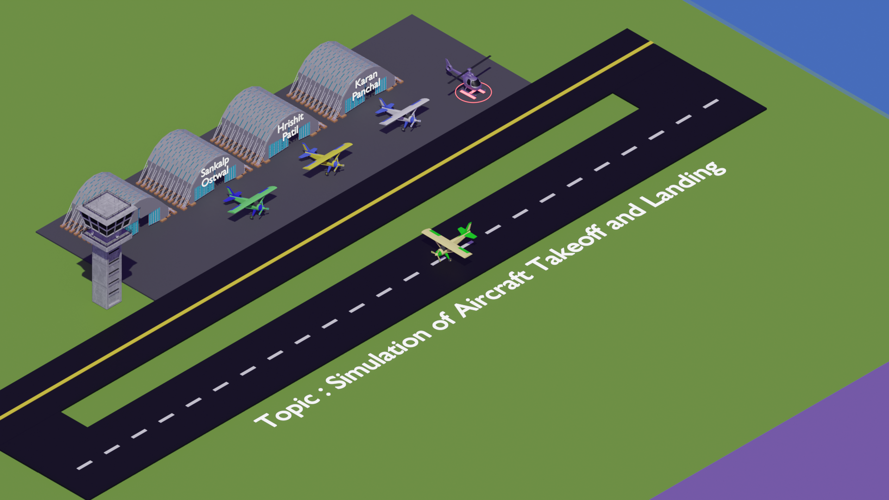
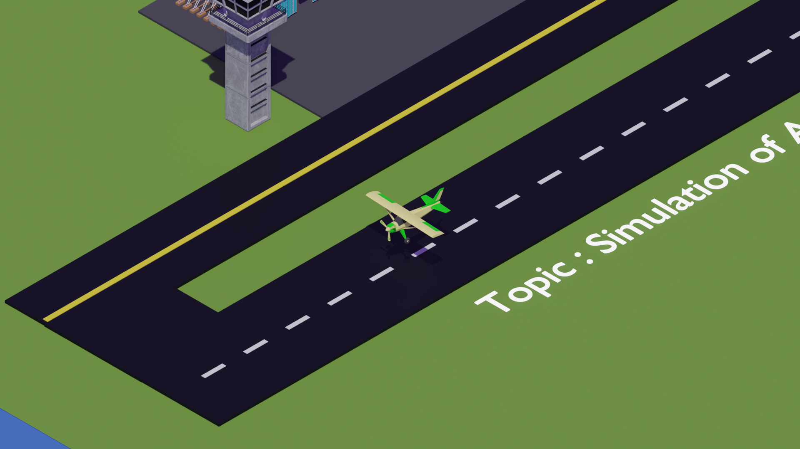
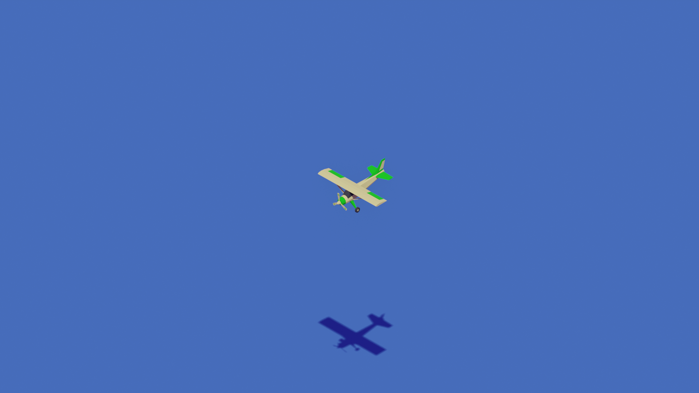
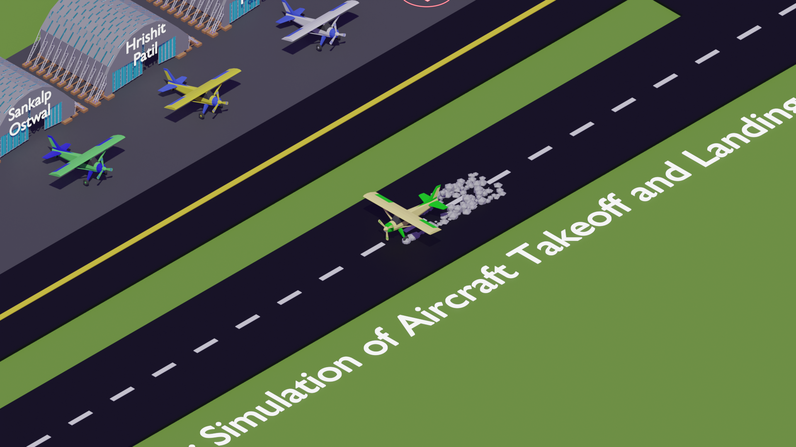

# ✈️ Aircraft Simulation using Blender

> A low-poly 3D aircraft takeoff and landing simulation built using **Blender**, featuring environment modelling, animation, lighting, rendering, and sound integration.


---

## 📖 Overview

This project showcases a complete low-poly airport environment with an animated aircraft takeoff and landing sequence. The entire scene was designed and animated in **Blender**, demonstrating key concepts of 3D modelling, animation, camera movement, lighting, rendering, and scene composition.

The project was developed as part of my exploration of computer graphics and 3D animation workflows.

---

# 🖼️ Preview

## Airport Overview



---

## Aircraft Takeoff



---

## Mid Flight



---

## Landing Sequence



---

# 🎥 Demo

The complete animation can be viewed here:

📹 **`media/aircraft-simulation-demo.mp4`**

---

# ✨ Features

- ✈️ Low-poly aircraft modelling
- 🛩️ Aircraft takeoff animation
- 🛬 Aircraft landing animation
- 🚁 Helicopter model
- 🏢 Airport environment
- 🛣️ Runway modelling
- 🎥 Camera animation
- 💨 Smoke particle effects
- 💡 Lighting setup
- 🎨 Material creation
- 🔊 Engine sound integration
- 🎞️ Final rendered animation

---

# 🛠️ Built With

| Software | Purpose |
|-----------|----------|
| Blender 5.x | 3D Modelling |
| Blender Animation | Keyframe Animation |
| Eevee Renderer | Real-time Rendering |

---

# 📂 Repository Structure

```text
Aircraft-Simulation-Blender/
│
├── README.md
├── LICENSE
│
├── source/
│   └── aircraft-simulation.blend
│
└── media/
    ├── aircraft-simulation-demo.mp4
    ├── propeller-sound.mp3
    ├── render-01.png
    ├── render-02.png
    ├── render-03.png
    └── render-04.png
```

---

# 🚀 Getting Started

### Clone the repository

```bash
git clone https://github.com/Hrishit-Patil/Aircraft-Simulation-Blender.git
```

Open the project in Blender:

```text
source/aircraft-simulation.blend
```

Render the animation or explore the scene using Blender.

---

# 🎯 Learning Outcomes

Through this project I gained practical experience in:

- 3D Modelling
- Scene Composition
- Low-poly Asset Creation
- Keyframe Animation
- Camera Animation
- Lighting Techniques
- Material Creation
- Rendering Workflow
- Particle Effects
- Environment Design

---

# 📌 Future Improvements

- 🌍 Larger airport environment
- 🌤️ Improved sky and lighting
- 🎨 Higher quality textures
- ✈️ Additional aircraft models
- 🚦 More airport assets
- 🌫️ Enhanced particle effects
- 🎥 Cinematic camera paths

---

# 👨‍💻 Author

**Hrishit Patil**

- GitHub: https://github.com/Hrishit-Patil
- LinkedIn: https://www.linkedin.com/in/hrishit-patil/

---

# ⭐ Support

If you found this project interesting, consider giving it a ⭐ on GitHub.

It helps support my work and motivates me to build more projects.